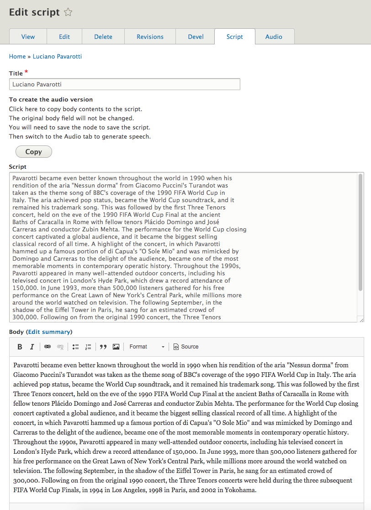
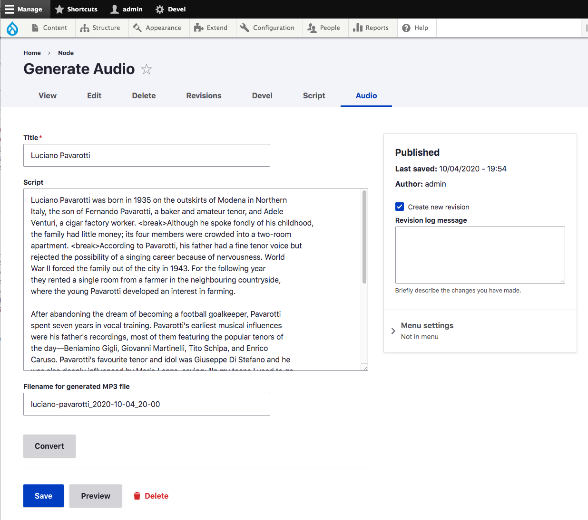
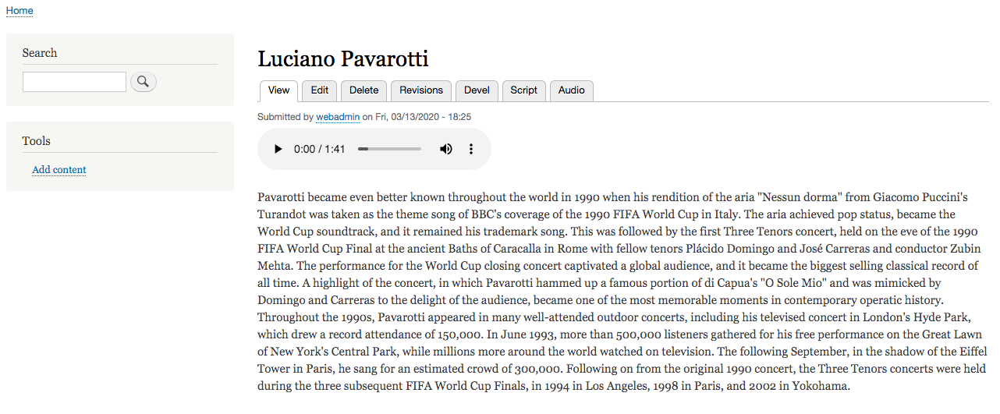

# Read to Me

Read to Me enables site owners to easily generate spoken versions of text articles using Google Cloud Text-to-Speech service.

## Features

- Convert any article to an audio script
- Edit the script as necessary
- Convert the script to audio with Google Text-to-Speech.
- The completed audio version is saved with your article as a media entity.

## Set-up

For an overview of [Google Cloud Text-to-Speech](https://cloud.google.com/text-to-speech) visit [https://cloud.google.com/text-to-speech](https://cloud.google.com/text-to-speech).

- See also Google’s [Text-to-Speech documentation](https://cloud.google.com/text-to-speech/docs)

To use the service:

1. You need to have a Google account.

2. Enable that account for Google Cloud Platform at [Google Cloud Text-to-Speech](https://cloud.google.com/text-to-speech)

4. Within the Google Cloud Platform, enable the Text-to-Speech API. You will need to enable billing (add a credit card) to use the API.

    - As of March 2020, there is a generous free trial to use for development ($300 or 365 days). Once the trial is over, Google charges for Text-to-Speech service by the number of characters converted. Depending on the voice chosen and word length, an 800 word article might cost $.06 for conversion.

5. Within the API, create a service account so that the Read to Me module can authenticate and access the Text-to-Speech service.

6. Once you have the service account, you need to create a key. The key is a multi-line JSON file; approximately 2KB in size, that you will download from Google and place on your Drupal installation, outside of the web root.

7. In the Read to Me settings form, you will enter the location in your file system where you placed the private key.

## Installation
1. Install the Read to Me module as you would [install any Drupal 8 module](https://www.drupal.org/docs/8/extending-drupal-8/installing-drupal-8-modules).
2. Enable the Read to Me module.
3. In the settings page [/admin/config/read-to-me/settings](/admin/config/read-to-me/settings), enter the location where you placed the JSON key.
4. Use this composer command to load the Google Text-to-Speech libraries:  composer require "google/cloud-text-to-speech:^0.5.0"

## Usage

The module will add two tabs to the standard Drupal node edit form.

They are Script and Audio.

**The Script tab allows you to convert your body copy to a plain text script.**

**The Audio tab allows you to send the script to Google Text-to-Speech.
Google Text-to-Speech will return an MP3 file which is attached to your document.**

**The spoken version appears as a field with your article.**

