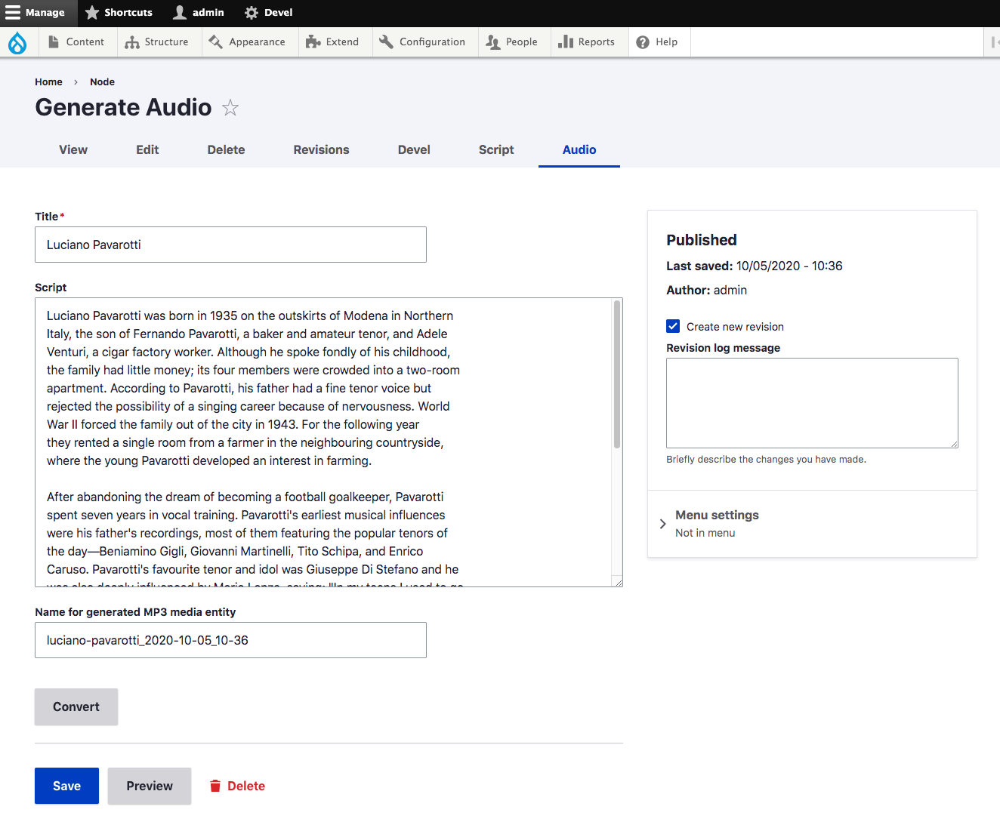

# Read to Me

Read to Me enables site owners to easily generate spoken versions of text articles using Amazon Polly text-to-speech service.

For more information on Amazon Polly, including sample voices, see: https://aws.amazon.com/polly/

## Features

- Convert any article to an audio script
- Edit the script as necessary
- Convert the script to audio with Amazon Polly.
- Amazon Polly converts your text to an MP3 file, which is stored on Amazon S3.
- The completed audio version is attached to your article as a media entity.

## Set-up

To use the service:

* You need to have an AWS account.
* You will also need to create a storage bucket on AWS S3 service.
*

7. In the Read to Me settings form, you will enter the location in your file system where you placed the private key.

## Installation
1. Install the Read to Me module as you would [install any Drupal 8 module](https://www.drupal.org/docs/8/extending-drupal-8/installing-drupal-8-modules).
2. Enable the Read to Me module.
3. In the settings page [/admin/config/read-to-me/settings](/admin/config/read-to-me/settings), enter your Amazon.

## Installation
1. Use this composer command to load the Amazon Polly PHP SDK:  composer require "aws/aws-sdk-php": "^3.18"

## Usage

The module will add two tabs to the standard Drupal node edit form.

They are Script and Audio.

**The Script tab allows you to convert your body copy to a plain text script.**

**The Audio tab allows you to send the script to Google Text-to-Speech.
Google Text-to-Speech will return an MP3 file which is attached to your document.**

**The spoken version appears as a field with your article.**

