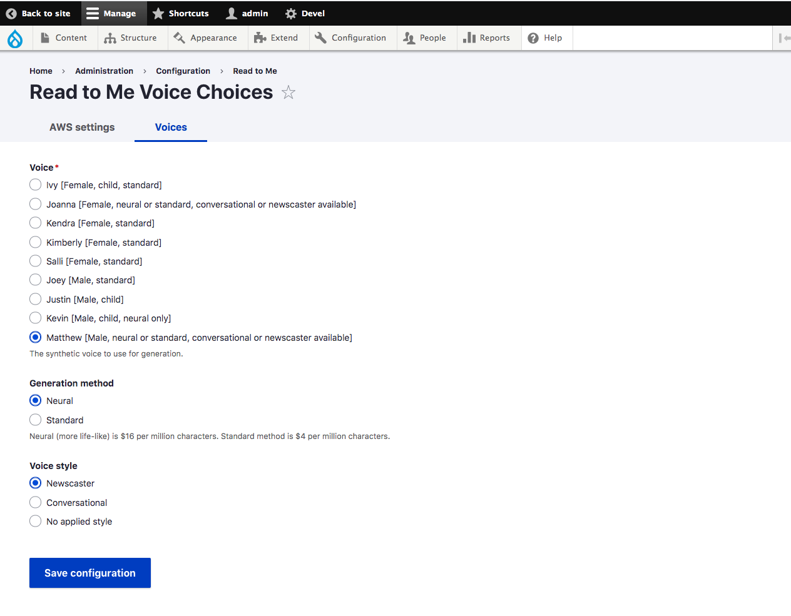
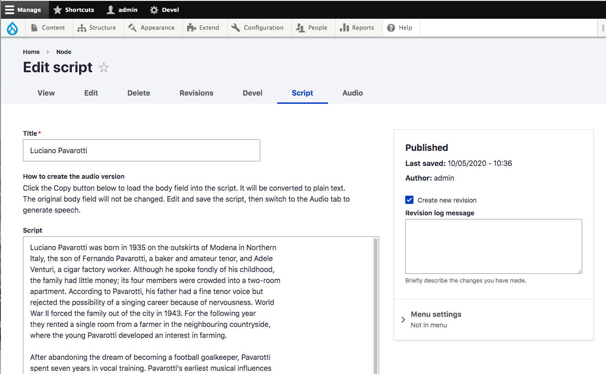

# Read to Me

Read to Me enables site owners to easily generate spoken versions of text articles using Amazon Polly text-to-speech service.

For more information on Amazon Polly, including sample voices, see: https://aws.amazon.com/polly/

## Features

- Convert any article to an audio script
- Edit the script as necessary
- Convert the script to audio with Amazon Polly.
- Amazon Polly converts your text to an MP3 file, which is stored on Amazon S3.
- The completed audio version is attached to your article as a media entity.

## Requirements

To use the service:

* Sign up for an AWS account.
* Link: https://aws.amazon.com/premiumsupport/knowledge-center/create-and-activate-aws-account/
* Create a storage bucket on AWS S3 service.
* Link: https://docs.aws.amazon.com/AmazonS3/latest/user-guide/create-bucket.html

## Installation
* Install the Read to Me module as you would [install any Drupal 8 module](https://www.drupal.org/docs/8/extending-drupal-8/installing-drupal-8-modules).
* The Media and Media Library modules (part of Drupal core) are required.
* Also, download and install Drupal module **media_entity_audio**:
* Link: https://www.drupal.org/project/media_entity_audio
* Use this composer command to load the Amazon Polly PHP SDK:
    - composer require "aws/aws-sdk-php": "^3.18"
* Enable the Read to Me module.
* In the settings page [/admin/config/read-to-me/settings](/admin/config/read-to-me/settings), enter your Amazon AWS Access Key ID and your AWS Secret Access Key.
* Also enter the name of the S3 bucket that you created
* See topic "Amazon notes" below for additional info on Amazon set-up.

## Choosing voices

* You need configure the voice you want for speech synthesis at [/admin/config/read-to-me/settings/voice](/admin/config/read-to-me/settings/voice).
* By default you choose from Amazon Polly's English voices.

* If your Drupal site's default language is something other English, this module will load voices for that language. Not every Drupal language choice will have Polly voices available.

* For Polly's list of languages and voices, see: https://docs.aws.amazon.com/polly/latest/dg/voicelist.html

## Usage

The module will add two tabs to the standard Drupal node edit form.

They are Script and Audio.

## Script Tab
**The Script tab allows you to convert your body copy to a plain text script.**

You can use the Copy button to copy the contents of the body field into the script field, removing the HTML formatting in the process.

_Before conversion_

_After conversion_

## Audio Tab
The Audio tab allows you to send the script to Amazon Polly.
Polly will create an MP3 file which is saved on Amazon S3.
This module will create a media entity from that MP3 and attach it the node.**

## Result
Here is final article with the audio player added.

## Media Entity

The generated audio file is added to the media library.

It can be removed or swapped with other media items in the library.

The media_entity_audio module allows the media entity to have a remote audio file (in the S3 bucket) as a source.

## Amazon notes

* You need to grant public read access for the files in the S3 bucket.
* Link: https://docs.aws.amazon.com/AmazonS3/latest/dev/WebsiteAccessPermissionsReqd.html
* It may take 10-15 seconds (longer for longer articles) for Polly to process the text and place the MP3 in the S3 bucket.
* This module uses Polly's StartSpeechSynthesisTask method to generate speech rather than SynthesizeSpeech.
* Link: https://docs.aws.amazon.com/polly/latest/dg/API_Reference.html
* The SynthesizeSpeech method returns MP3s directly to the server (no S3 required) but there is a limit of 3000 characters per job.
* StartSpeechSynthesisTask allows jobs of up to 100,000 characters.

## Road map

* Enable site users to send a link to the generated audio to their mobile devices.

### Credit

Text of the sample article from Wikipedia
https://en.wikipedia.org/wiki/Luciano_Pavarotti
